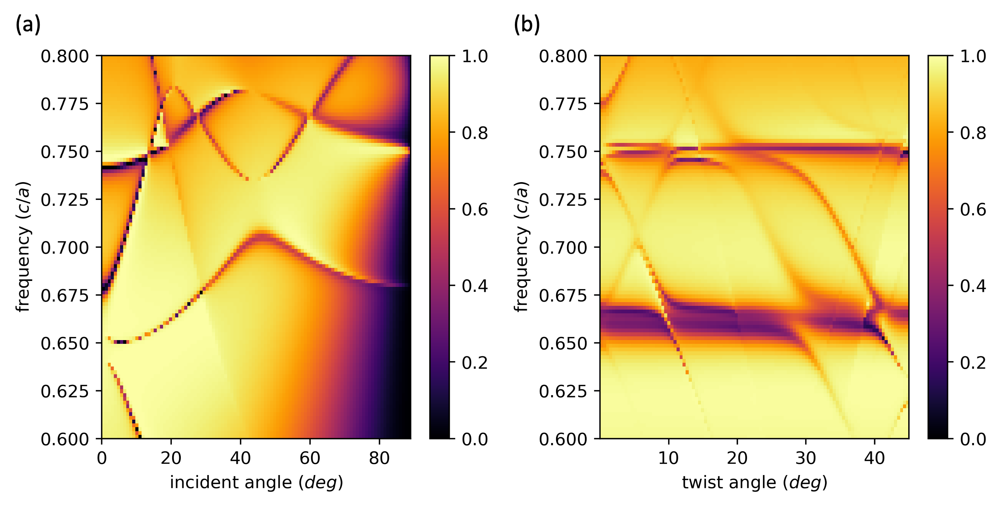

# RCWA4D

[](https://github.com/fancompute/rcwa4d/actions/workflows/tests.yml)
[](https://www.python.org)
[](LICENSE)
[](https://doi.org/10.1016/j.cpc.2024.109356)

**RCWA4D** is an electromagnetic solver for layered structures whose layers have
**incommensurate periodicities**, such as twisted bilayer (moiré) photonic crystal slabs.
It extends rigorous coupled-wave analysis (RCWA) to compute transmission, reflection,
diffraction efficiencies, and internal fields of such quasi-periodic stacks.

<p align="center">
  
</p>

## Features

- Multilayer stacks where each layer follows one of two lattices rotated by an arbitrary twist angle
- Standard RCWA for untwisted stacks, and an extended ("4D") plane-wave basis for twisted ones
- Arbitrary 2D patterns: permittivity (and permeability) given as a real-space array per unit cell
- Total and per-order reflection/transmission for any incident angle and polarization
- Fourier coefficients of fields inside the stack and in the reflection and transmission regions
- Uniform superstrate and substrate media
- Pure NumPy/SciPy

## Installation

```bash
pip install git+https://github.com/fancompute/rcwa4d.git
```

For development (editable install with test dependencies):

```bash
git clone https://github.com/fancompute/rcwa4d.git
cd rcwa4d
pip install -e ".[dev]"
pytest
```

## Quick start

```python
import numpy as np
from rcwa4d import RCWA

# One unit cell: dielectric slab (eps = 4) with a circular air hole of radius 0.25a
n = 256
x, y = np.meshgrid(np.linspace(-0.5, 0.5, n), np.linspace(-0.5, 0.5, n))
eps = np.where(x**2 + y**2 < 0.25**2, 1.0, 4.0)

# Two identical slabs separated by an air gap, the bottom one twisted by 5 degrees
sim = RCWA(
    epsr_list=[eps, None, eps],  # None marks a uniform air gap
    thickness_list=[0.2, 0.1, 0.2],  # in units of the lattice constant a
    orientation_list=[1, 1, 2],  # which lattice each layer follows (2 = twisted)
    twist=np.deg2rad(5),  # rotation of lattice 2
    N=1,  # Fourier orders -N..N along x
    M=1,  # Fourier orders -M..M along y
)

sim.set_freq_k(0.75, theta_phi=(0, 0))  # frequency in c/a, normal incidence
(R, T), (r0, t0) = sim.get_RT(pte=0, ptm=1)  # TM-polarized plane wave
print(f"R = {R:.4f}, T = {T:.4f}")
```

**Units and conventions.** Lengths are in units of the lattice constant `a` and frequencies
in units of `c/a`. Light comes in from the reflection half-space (`e_r`, `m_r`, vacuum by default),
passes through the layers in order, and exits into the transmission half-space (`e_t`, `m_t`).
Angles are in radians.

**Convergence.** The twisted solver uses `[(2N+1)(2M+1)]²` plane waves, so cost grows quickly
with `N` and `M`. Always check that your results converge as you increase the truncation
(see [example 3](examples/example3-convergence-check.ipynb)).

### Main API

| | |
|---|---|
| `RCWA(epsr_list, thickness_list, orientation_list, twist=..., N=..., M=..., e_r=..., e_t=...)` | Define the stack |
| `sim.set_freq_k(freq, theta_phi=(theta, phi))` or `kxy_inc=(kx, ky)` | Set frequency and incidence |
| `sim.get_RT(pte, ptm)` | Total `(R, T)` and 0th-order complex amplitudes; per-order efficiencies in `sim.R_orders`, `sim.T_orders` |
| `sim.get_internal_field(layers, offsets)` | Field Fourier coefficients inside the stack (needs `get_RT(..., storing_intermediate_Smats=True)`) |
| `sim.get_RT_field()` | Field Fourier coefficients of the reflected and transmitted waves |
| `sim.Sg` | Global scattering matrix (dict with `S11`, `S12`, `S21`, `S22`) |

## Examples

The [`examples/`](examples) folder contains Jupyter notebooks (`pip install -e ".[examples]"`):

| Notebook | Content |
|---|---|
| [`example0-band-structure`](examples/example0-band-structure.ipynb) | Transmission vs. frequency, in-plane wavevector, and twist angle |
| [`example1-scattering-matrix`](examples/example1-scattering-matrix.ipynb) | Scattering matrices of single-layer and twisted bilayer photonic crystals |
| [`example2-phase-inference`](examples/example2-phase-inference.ipynb) | Inferring the relative phase of two beams from twist-dependent intensity |
| [`example3-convergence-check`](examples/example3-convergence-check.ipynb) | Convergence with respect to Fourier truncation |
| [`example4-redundant-periods`](examples/example4-redundant-periods.ipynb) | Sanity check using supercells with repeated periods |

## Citing

If you use RCWA4D in your research, please cite the companion paper:

> B. Lou and S. Fan, "RCWA4D: Electromagnetic solver for layered structures with incommensurate
> periodicities," *Computer Physics Communications* **306**, 109356 (2025).
> [doi:10.1016/j.cpc.2024.109356](https://doi.org/10.1016/j.cpc.2024.109356)

```bibtex
@article{lou2025rcwa4d,
  title   = {{RCWA4D}: Electromagnetic solver for layered structures with incommensurate periodicities},
  author  = {Lou, Beicheng and Fan, Shanhui},
  journal = {Computer Physics Communications},
  volume  = {306},
  pages   = {109356},
  year    = {2025},
  doi     = {10.1016/j.cpc.2024.109356}
}
```

The method was first introduced in:

> B. Lou, N. Zhao, M. Minkov, C. Guo, M. Orenstein, and S. Fan, "Theory for twisted bilayer
> photonic crystal slabs," *Phys. Rev. Lett.* **126**, 136101 (2021).
> [doi:10.1103/PhysRevLett.126.136101](https://doi.org/10.1103/PhysRevLett.126.136101)

<details>
<summary><b>Related publications</b> (experimental validation and applications)</summary>

Experimental validation:

- B. Lou, B. Wang, J. A. Rodríguez, M. Cappelli, and S. Fan, "Tunable guided resonance in twisted
  bilayer photonic crystal," *Sci. Adv.* **8**, eadd4339 (2022) — microwave.
  [doi:10.1126/sciadv.add4339](https://doi.org/10.1126/sciadv.add4339)
- H. Tang, B. Lou, F. Du, M. Zhang, X. Ni, W. Xu, R. Jin, S. Fan, and E. Mazur, "Experimental probe of
  twist angle–dependent band structure of on-chip optical bilayer photonic crystal,"
  *Sci. Adv.* **9**, eadh8498 (2023) — optical.
  [doi:10.1126/sciadv.adh8498](https://doi.org/10.1126/sciadv.adh8498)

Applications:

- B. Lou and S. Fan, "Tunable frequency filter based on twisted bilayer photonic crystal slabs,"
  *ACS Photonics* **9**, 800 (2022).
  [doi:10.1021/acsphotonics.1c01263](https://doi.org/10.1021/acsphotonics.1c01263)
- C. Guo, Y. Guo, B. Lou, and S. Fan, "Wide wavelength-tunable narrow-band thermal radiation from
  moiré patterns," *Appl. Phys. Lett.* **118**, 131111 (2021).
  [doi:10.1063/5.0047308](https://doi.org/10.1063/5.0047308)
- X. Ni, Y. Liu, B. Lou, M. Zhang, E. L. Hu, S. Fan, E. Mazur, and H. Tang, "Three-dimensional
  reconfigurable optical singularities in bilayer photonic crystals,"
  *Phys. Rev. Lett.* **132**, 073804 (2024).
  [doi:10.1103/PhysRevLett.132.073804](https://doi.org/10.1103/PhysRevLett.132.073804)
- H. Tang *et al.*, "On-chip multidimensional dynamic control of twisted moiré photonic crystal for
  smart sensing and imaging," [arXiv:2312.09089](https://arxiv.org/abs/2312.09089) (2023).

</details>

## Contributing and contact

Bug reports and feature requests are welcome on the
[issue tracker](https://github.com/fancompute/rcwa4d/issues). For collaborations and other
inquiries, contact Beicheng Lou at beichenglou@stanford.edu.

## License

[MIT](LICENSE) © 2024 Fan Group
